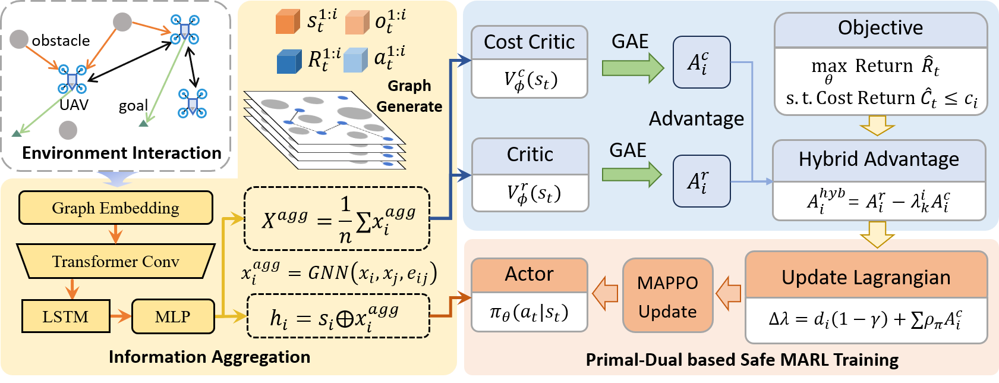
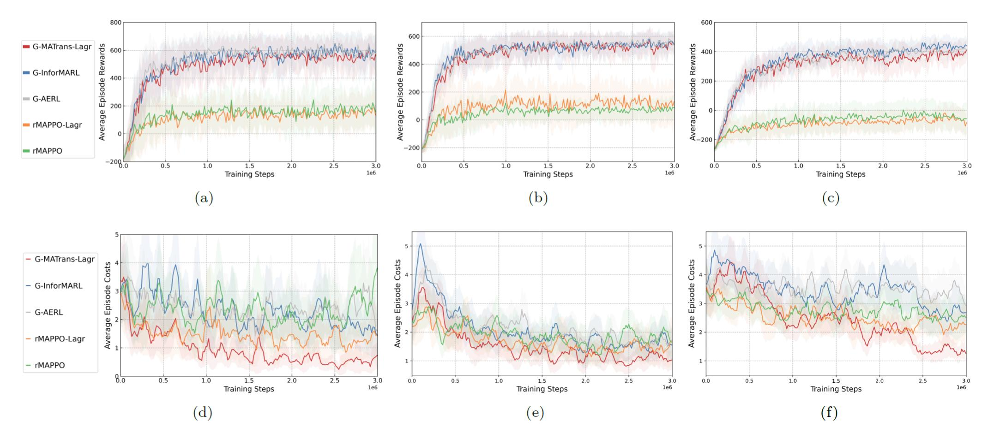
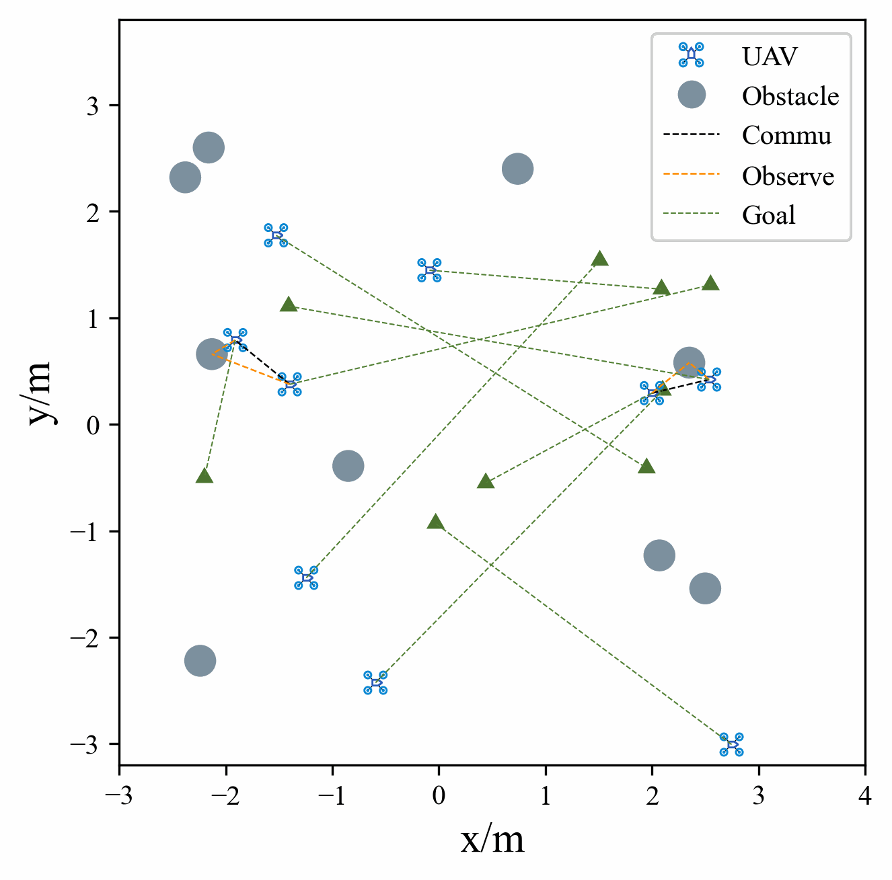
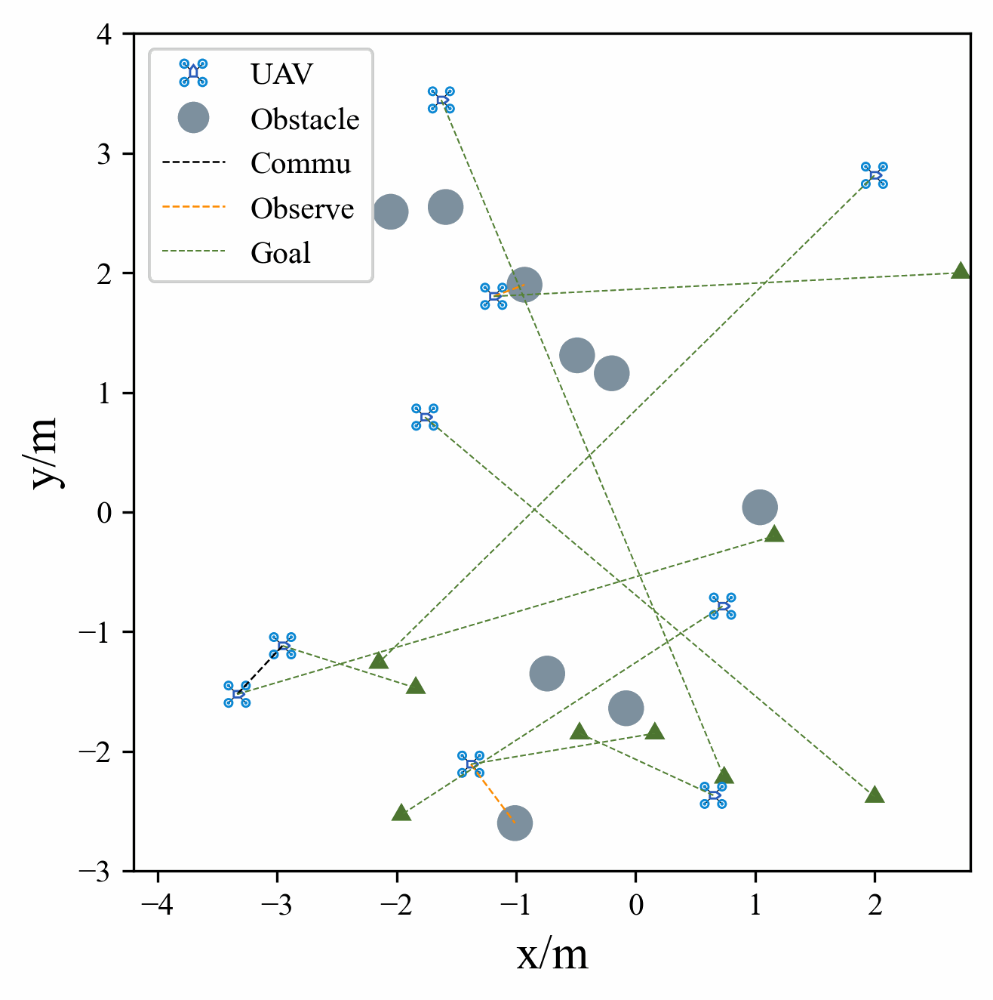

# G-MAT-Lagr

## Overview
This is the implementation of *Primal-Dual based Safe Multi-Agent Reinforcement Learning with Graph Information Aggregation*, submission to 2026 IFAC world congress.

## Dependencies & Installation
We recommend to use CONDA to install the requirements:
```shell
conda create -n G-MAT-Lagr python=3.8
conda activate G-MAT-Lagr
pip install -r requirements.txt
```
Install G-MAT-Lagr:
```shell
pip install -e .
```

The requirements.txt file contains the list of dependencies needed for this project, and is exported directly from our conda environment. Actually, there are some redundant packages, you can also follow the steps below for quick installation:

```shell
conda create -n G-MAT-Lagr python=3.8
conda activate G-MAT-Lagr
conda install pytorch torchvision torchaudio pytorch-cuda=12.1 -c pytorch -c nvidia # according to your cuda version
```

Then, install the following packages, and if there are error report missing any packages when running the code, you can install them using conda or pip.
```shell
pip install --upgrade pip
pip install --upgrade setuptools
 pip install setproctitle, absl-py，gym，wandb，scipy，shapely，tensorboardX，imageio，seaborn, torch-geometric, torch-scatter, torch-sparse
```

## Run

### Environment
We have modified the Multi-agent Particle Environment (MPE) to better facilitate Safe Multi-Agent Reinforcement Learning (MARL) algorithms. The modifications are implemented in the `G-MAT-Lagr/multiagent/environment.py` file, where we have defined the environments to accommodate our safe MARL algorithms with GNN. Our code is developed based on *MAPPO* and *InforMARL*, which we suggest users to get familiar with the framework first.

### Scenario
Users can use the cooperative navigation scenario described in the paper or create and use custom scenarios. The scenario files should be placed in the `G-MAT-Lagr/multiagent/scenarios` directory.

### Parameter
All parameters and their detailed functions are described in the `G-MAT-Lagr/config.py` file. Users can modify the default values for different training or testing tasks as needed. We also manage the parameters in the shell script, which you can find in the `train_your_scenario.sh` file and the `render_your_scenario.sh` file.

### Train
To train the model using G-MAT-Lagr, follow these steps:
```shell
cd G-MAT-Lagr/train_scripts
bash train_your_scenario.sh
```
The training logs will be saved in the `G-MAT-Lagr/train_scripts` directory, and the relevant data save code are in the graph_lagr_mpe_runner.py file. If you have enabled Weights & Biases (wandb), the logs will also be uploaded to your wandb project.

### Test
To test the model trained by G-MAT-Lagr, follow these steps:
```shell
cd G-MAT-Lagr/render_scripts
bash render_your_scenario.sh
```
Setting `use_render` to `True` will enable rendering of the environment in a separate window. Additionally, if `save_gifs` is set to `True`, the generated gifs will be saved to the directory where the model parameter is saved.

## Demos

The overall architecture and training reward&cost are demonstrated in the following figures. To see more details, please refer to our paper.

### The framework of G-MAT-Lagr 
 

### The training curve of reward and cost


### Train on cooperative navigation with different numbers of UAVs

<p align="center">
The scenario of 3 UAVs<br>

 
The scenario of 6 UAVs<br>

</p>

<p align="center">
The scenario of 9 UAVs<br>

 
 
</p> 
